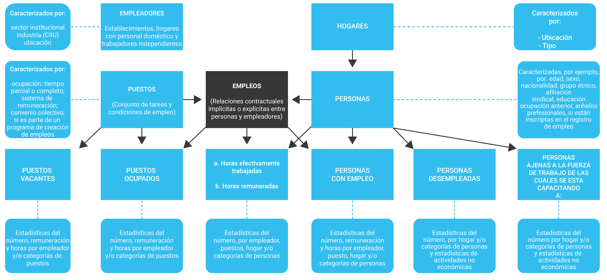

# **La medición del empleo en turismo** {#medicion-empleo}

Este capítulo propone un recorrido por los principales conceptos sobre la economía laboral, las metodologías de medición del empleo en el sector turístico (según las recomendaciones de la OMT) y su aplicación tanto en Argentina como en el resto del mundo. 
El  mercado laboral es definido como el mercado en donde confluyen la demanda y la oferta de trabajo. Los componentes del mercado son expresados en cantidades (puestos de trabajo y personas ocupadas) y precios (salarios) que generalmente se asocian al bienestar de la economía.
La demanda en el mercado de trabajo es efectuada por las empresas para poder desempeñar su actividad económica. La cantidad de trabajadores a emplear dependerá de la cantidad de puestos de trabajo que se requiera ocupar para la actividad en cuestión. 
En tanto que la oferta de trabajo es efectuada por las personas a partir de ofrecer sus servicios a las empresas, o trabajar en forma independiente, a cambio de una retribución.

La figura \@ref(fig:empleooit) representa una perspectiva esquemática del mercado de trabajo con sus componentes (elementos estructurales) y relaciones. Muestra que las “personas” representan el lado de la oferta en el mercado de trabajo, mientras que los “puestos” el lado de la demanda. Los casilleros cuadrados en las primeras dos filas incluyen a los empleadores y a los hogares, además de los puestos y las personas. Los “puestos” y las “personas” se vinculan a través de los empleos. 

Para mayor información consulte el documento de la @oit2014.

En la tercera fila aparecen más casilleros que muestran las subcategorías de puestos y personas ocupadas. El sistema de contabilidad del trabajo requiere que se establezcan estimaciones para todos sus componentes y las relaciones de éstos. 

Como se explicará en las secciones siguientes, el empleo en turismo no puede ser observado en forma directa, al menos aquel que se refiere al empleo estrictamente relacionado con los bienes y servicios adquiridos por los visitantes, sin importar si la industria que los produjo es turística o no, por lo tanto, este documento analiza el enfoque de oferta (ó ramas características del turismo[^5])

[^5]: Se utilizarán indistintamente los términos “Industria” o “Rama”

```{r empleooit, echo=FALSE, fig.cap="Marco conceptual del Mercado de Trabajo" }

```

## Definiciones generales sobre medición del empleo

Es importante conocer a qué se refieren las estadísticas laborales cuando miden trabajo y empleo. Partiendo de la definición de la [OIT](https://www.ilo.org/global/lang--es/index.htm), el **trabajo**[^6] corresponde al conjunto de actividades humanas, remuneradas o no, que producen bienes o servicios en una economía, o que satisfacen las necesidades de una comunidad o proveen los medios de sustento necesarios para los individuos. En este contexto, el **empleo** es definido como el trabajo efectuado a cambio de una remuneración que puede ser denominado salario, sueldo, comisión, propina, pago a destajo o pago en especie sin importar la categoría de empleo (patrón, asalariado, cuentapropista, etc.).

Por otra parte, la OIT categoriza un empleo según el tipo de contrato de trabajo explícito o implícito del titular con otras personas u organizaciones. A partir del año 1993 se creó la Clasificación Internacional de la Situación en el Empleo (CISE, 1993)[^7] que sirve para agrupar las distintas modalidades vigentes y para comprender su alcance según el sector que se pretenda estudiar. El criterio básico utilizado para definir cada grupo de categoría o clasificación ocupacional está basado en el tipo de **riesgo económico**, un elemento del cual depende exclusivamente la solidez del vínculo entre la persona y el empleo, y el tipo de responsabilidad que tiene el trabajador sobre el establecimiento.

[^6]: En la actualidad, siguiendo las recomendaciones de la OIT, el concepto trabajo ha sido ampliado a “Trabajo Decente”. Dicho concepto reconoce que el trabajo  promueve la dignidad personal, el crecimiento económico, la estabilidad familiar, la paz en la comunidad, la democracia, la productividad y el desarrollo de las empresas.

[^7]: [Resolución CISE, 1993](http://www.ilo.org/public/spanish/bureau/stat/download/res/icse.pdf)

Las personas con ***empleos independientes*** pueden dividirse en dos grupos, aquellas que tienen trabajadores asalariados a cargo se clasifican como ***“empleadores”*** o ***“patrones”***, mientras que aquellas que no los tienen se clasifican como ***“trabajadores por cuenta propia”***. El término empleo independiente alcanza aquel tipo de trabajo donde la remuneración depende directamente de los beneficios (o del potencial para realizar beneficios) derivados de los bienes o servicios producidos (el consumo propio forma parte de los beneficios). El titular toma las decisiones operacionales que afectan a la empresa, o delega tales decisiones, pero mantiene la responsabilidad por el bienestar de la empresa.

Por otro lado, los trabajadores con un empleo asalariado son clasificados dentro de la categoría ***“empleo en relación de dependencia”***, situación que refiere a aquel trabajador que recibe una remuneración básica que no depende directamente de los ingresos de la unidad para la que trabaja.

Cabe aclarar que todas las categorías mencionadas anteriormente pueden identificarse tanto en el marco de la economía formal como de la economía informal. El término ***"economía informal”***[^8] hace referencia *“al conjunto de actividades económicas desarrolladas por los trabajadores y las unidades económicas que, tanto en la legislación como en la práctica, están insuficientemente contempladas por sistemas formales o no lo están en absoluto. Las actividades de esas personas o empresas pueden no estar alcanzadas por la ley, es decir, se desempeñan al margen de ella; o bien no están contempladas en la práctica, es decir que, si bien estas personas operan dentro del ámbito de la ley, ésta no se aplica o no se cumple”* (OIT – Conferencia Internacional de Trabajo, 2014). 

Además, existen grandes diferencias entre los trabajadores de la economía informal en cuanto a ingresos (nivel, regularidad, estacionalidad), situación en el empleo (asalariados, empleadores, trabajadores por cuenta propia, trabajadores ocasionales, trabajadores domésticos), sector (comercio, agricultura, industria), tipo de empresas y tamaño de las mismas, ubicación geográfica (medio urbano o rural), protección social (contribuciones  a la seguridad social), y protección del empleo (tipo y duración del contrato, derecho a vacaciones anuales).
Por lo tanto, en un sistema económico los trabajadores pueden desempeñarse bajo una modalidad de Empleo Formal o Empleo Informal. La distinción entre uno u otro está dada por el cumplimiento de la legislación laboral en relación con las personas involucradas en la unidad productiva o en su propio emprendimiento económico cumpliendo con alguna de las normas que regulan sus actividades económicas y las obligaciones previsionales.


[^8]:  [OIT: “La transición de la economía informal a la economía formal”, Conferencia Internacional del Trabajo, 103.ª reunión, 2014](https://www.ilo.org/wcmsp5/groups/public/---ed_norm/---relconf/documents/meetingdocument/wcms_218350.pdf)

En síntesis, se considera que los trabajadores se encuentran en la modalidad de un ***Empleo Informal***[^9] si su relación de trabajo, de derecho o de hecho, no está sujeta a la legislación laboral nacional, la protección social o a determinadas prestaciones relacionadas con el empleo (cobertura jubilatoria con descuento, cobertura jubilatoria con aporte voluntario, preaviso al despido, indemnización por despido, vacaciones anuales pagadas o licencia pagada por enfermedad, etc.). 

Por lo tanto, las principales definiciones a tener en cuenta son (OIT, 2004)REFERENCIA:

-   **Persona ocupada[^10]:** es un individuo físico que realiza ciertas tareas laborales,  pudiendo ocupar uno o más puestos de trabajo;
-   **Puesto ocupado:** corresponde a una persona empleada para realizar un conjunto de tareas en una empresa o negocio;
-   **Empleador o Patrón:** es aquel que, trabajando por su cuenta o con uno o más socios, ha contratado a una o a varias personas para que trabajen en su empresa como “asalariados” a lo largo de un período continuo que incluye el período de referencia. Los titulares pueden tomar las decisiones operacionales que afectan a la empresa, o bien delegarlas, pero mantienen la responsabilidad por el bienestar de la empresa;

-   **Trabajador por cuenta propia:** es aquel trabajador que, trabajando por su cuenta o con uno o más socios, no ha contratado a ningún “asalariado” de manera continua durante el período de referencia. Cabe notar que durante el período de referencia los miembros de este grupo pueden haber contratado “asalariados”, siempre y cuando lo hagan de manera esporádica;
- **Asalariado:** es aquel trabajador que tiene un empleo en relación de dependencia y que posee, por lo tanto, un contrato de trabajo implícito o explícito (oral o escrito) con el mismo empleador de manera continua. Los empleados asalariados son los trabajadores que reciben una remuneración básica, la cual no depende directamente de los ingresos de la unidad para la que trabaja. Además, la organización empleadora es responsable por el pago de las cargas fiscales y de las contribuciones de la seguridad social del empleado (a partir de las exigencias de la legislación nacional de trabajo).


**AGREGAR ALGUNOS CONCEPTOS DE:**
**EMPLEO VERDE **
**EMPLEO DECENTE**


[^9]: Según la OIT, las razones pueden ser las  siguientes: la no declaración de los empleos o de los asalariados; empleos ocasionales o empleos de limitada o corta duración; empleos con un horario o un salario inferior a un límite especificado (por ejemplo para cotizar a la seguridad social); el empleador es una empresa no constituida en sociedad o una persona miembro de un hogar; el lugar de trabajo del asalariado se encuentra fuera de los locales de la empresa del empleador (por ejemplo, los trabajadores fuera del establecimiento y sin contratos de trabajo); empleos a los cuales el reglamento laboral no se aplica, no se hace cumplir o no se hace respetar por otro motivo.
[^10]: En Argentina se considera como persona ocupada a todos los individuos que tengan cierta edad específica (10 años o más) y que durante un período de referencia (una semana) hayan trabajado al menos una hora. Incluye: a) las personas que durante el período de referencia realizaron algún trabajo de al menos una hora, sin importar si recibieron pago (en dinero o en especie) o no por dicha actividad; b) las personas que tienen una ocupación, pero que no están trabajando temporalmente durante el período de referencia y mantienen un vínculo formal con su empleo. Integran este grupo los ocupados que no trabajaron en la semana, por vacaciones, licencia por enfermedad u otros tipos de licencias, suspendidos con pago y ausentes por otras causas laborales (mal tiempo, averías mecánicas, escasez de materias primas, etc.) con límite de tiempo de retorno. Se incluyen también dentro de esta categoría a las personas que tienen un negocio o empresa y no trabajaron por causas circunstanciales durante el período de referencia.

## Recomendaciones Internacionales sobre el empleo en industrias turísticas

Las Recomendaciones Internacionales sobre Estadísticas de Turismo ([RIET 2008](https://unstats.un.org/unsd/publication/seriesm/seriesm_83rev1s.pdf)) describen dos formas de medir el empleo relacionado con el turismo. Por un lado, se denomina Empleo Turístico *"al empleo estrictamente relacionado con los bienes y servicios (característicos del turismo, el turismo conexo y otros) adquiridos por los visitantes y producidos por cualquiera de las industrias del turismo y otras industrias"*,  mientras que el Empleo en las Industrias Turísticas se refiere al empleo en las actividades características del turismo.
Las RIET 2008 sugieren un marco metodológico para medir el nivel y características del empleo generado por la industria del turismo *desde una perspectiva de la oferta*, a través de la selección de empresas o industrias características del  turismo. Es decir, se tiene en cuenta el empleo generado en una selección de ramas de actividad económica características del Turismo.
Además, menciona las particularidades del sector a la hora de estimar el empleo turístico, haciendo referencia a que las actividades características del turismo suelen requerir abundante mano de obra, que, si bien puede asociarse a la producción total de un establecimiento,  no puede asignarse a una producción particular *sin la utilización de hipótesis y de procedimientos de modelización*. 
Por este motivo, no se puede observar directamente el empleo en turismo, haciendo referencia al empleo estrictamente relacionado con los bienes y servicios (característicos del turismo, conexos al turismo y de otro tipo) adquiridos por los visitantes y producidos por las industrias turísticas u otras industrias. 
Dado que el objetivo de este trabajo es explorar las estadísticas del empleo en el sector turístico, el enfoque será puesto en el empleo en las industrias turísticas, es decir, el empleo en el sector, con independencia de que los productos y/o servicios fueran adquiridos por los turistas o no. Del mismo modo, no serán contempladas aquellas ramas de actividad que producen bienes o servicios que los visitantes eventualmente pueden consumir, pero que no constituyen industrias típicas del sector.

## Empleo en las ramas de actividad económica

Las estimaciones del empleo en el sector se verían resueltas con facilidad si pudieran ser calculadas en base al volumen de los bienes y servicios consumidos únicamente por los turistas. Sin embargo, la asociación de un nivel de empleo a un volumen de bienes y servicios es muy difícil de lograr y de justificar teóricamente. Por esta razón, para identificar el empleo en las industrias turísticas se debe recurrir a la selección de las ramas características, lo cual, además, permite identificar la composición del empleo turístico por categoría ocupacional. 
Con este objetivo, se utilizará la [CIIU Rev. 4](https://unstats.un.org/unsd/publication/seriesm/seriesm_4rev4s.pdf) y la correspondiente delimitación de ramas características del turismo, tal como se explicita en la sección 1.1.1 del presente documento.

## Dificultades generales para la estimación del empleo en la industria turística

Desde los postulados planteados, el análisis de las fuentes que brindan información sobre el mercado de trabajo en Argentina permite adelantar un conjunto de problemas específicos para el abordaje de la medición del empleo en turismo a partir del enfoque de ramas características. La metodología de estimación diseñada procura solucionar, de la *mejor forma posible*, los siguientes problemas:

-   **Identificación de las empresas del sector:** dificultad para definir con exactitud las empresas (y sus trabajadores) dedicadas a ofrecer productos y/o servicios al sector y para extraer aquellos componentes no turísticos a partir del cruce de las distintas fuentes de información, debido a los diferentes niveles de desagregación con que se presenta la información y/o a la utilización de distintos nomencladores de la actividad económica.
-   **Estacionalidad:** las fluctuaciones de la demanda turística introducen variaciones en el volumen del empleo. Esto es especialmente claro en el dominio de la pequeña empresa familiar, en donde la contratación temporal permite cubrir épocas de mayor demanda. Adela Mariscal (2005) en su trabajo “Mercado de Trabajo y turismo en Andalucía” señala que donde existen estructuras consolidadas (pymes, cadenas hoteleras, etc.), la estabilidad y la calidad del empleo son mayores, pero que en los casos de micropymes, cooperativas, sociedades anónimas laborales, etc., y donde además puede existir vulnerabilidad económica y territorial, el empleo es altamente estacional. Esta reflexión, sin dudas, aplica también para el caso argentino.
-   **Trabajo informal:** el alto nivel de empleo informal puede implicar la subestimación del impacto del turismo en el empleo. Según el documento “Empleo y Recursos Humanos en España” (Sancho, 1998), los principales sectores de la economía informal son la agricultura y los servicios (hoteles y restaurantes, servicios privados de limpieza y trabajo doméstico). Además, existe una alta rotación de los empleos, que es más significativa en el sector hotelería y restaurantes, con tasas superiores al 30% (Greffe, 1994; OIT, 1997). Los principales afectados son los asalariados de pequeños y medianos establecimientos, los cuentapropistas y los trabajadores familiares no remunerados. Resulta evidente que obtener información robusta sobre este subuniverso es más complejo que hacerlo sobre los establecimientos o empleados formalizados.
-   **Periodicidad:** continuidad en la disponibilidad de los datos, así como antigüedad de las series.
-   **Cobertura:**  falta de cobertura de la totalidad del territorio (geográfico o económico) bajo estudio. 
-   **Robustez y fiabilidad:** las encuestas por muestreo implican diseños que no permiten realizar estimaciones pequeñas con márgenes de error razonables. Esto implica necesariamente el desarrollo de estrategias que utilicen las estimaciones del modo más agregado posible pero que, a su vez, permita dar cuenta de las aperturas relevantes que se procuran estimar (provincia, sector, categoría ocupacional).


** Se puede agregar una sección sobre recomendaciones generales a tener en cuenta para estimar el empleo. Tipo, qué sería bueno que tengan en cuenta al momento de relevar información como para poder obtener información robusta (símil sección 1.2.1 del cap 1)**

## Antecedentes de la medición del empleo en turismo en Argentina

En Argentina, el Ministerio de Turismo y Deportes de la Nación con la colaboración de la Dirección Nacional de Cuentas Nacionales (DNCN) del INDEC realizó una estimación del volumen de empleo en las ramas de actividad características del turismo con base en el año 2004 y la serie para los años 2016-2019, consistentes con la estimación del nivel de  actividad de la industria del turismo. 
La DNCN proveyó, a pedido del Ministerio de Turismo y Deportes, información de los puestos de trabajo de las actividades económicas a un nivel de desagregación de 3 dígitos de la CIIU Rev. 3, y para los asalariados privados registrados a 5 dígitos. De esta manera, fue posible la estimación de la contribución del empleo del turismo desde la perspectiva de la oferta. 
Para los resultados de las estimaciones realizadas se logró apertura para las ramas agrupadas en las siguientes categorías:

-   **Agencias de viaje:** *agencias de viaje.*
-   **Transporte terrestre:** *ferroviario interurbano; taxis y remises; automotor interurbano; automotor para el turismo.*
-   **Transporte acuático:** *marítimo y fluvial de pasajeros.*
-   **Transporte aéreo:** *aéreo de pasajeros.*
-   **Servicios anexos del transporte:** *peajes.*
-   **Alojamiento:** *camping; hoteles, hosterías y similares; Servicios inmobiliarios realizados por cuenta propia, con bienes propios o arrendado.; Servicios inmobiliarios realizados a cambio de una retribución o por contrato.*
-   **Gastronomía:** *restaurantes y similares; comidas por vendedores ambulantes; rotiserías.*
-   **Otros:** *cines; espectáculos teatrales, musicales y artísticos; artísticos y de diversión  NCP; bibliotecas; museos y preservación de lugares y edificios históricos; botánicos, zoológicos y parques nacionales; otros culturales; prácticas deportivas; salones de juegos y entretenimiento NCP*.

Los datos de la estimación se presentan desagregados en las siguientes categorías ocupacionales (que surgen, más precisamente, de la combinación entre el nivel de formalidad y de independencia de los trabajadores):

-   **Asalariados Registrados (AR):** obreros o empleados con descuento jubilatorio realizado por el empleador
-   **Asalariados No Registrados (ASNR):** obreros o empleados sin descuento jubilatorio realizado por el empleador
-   **No Asalariados (NOASAL):** patrones, cuentapropistas y trabajadores familiares no remunerados.

En cuanto a las fuentes de información, la principal es la Cuenta Generación del Ingreso elaborada por la DNCN, que ofrece el dato (con una periodicidad cuatrimestral) de la cantidad de puestos de trabajo por rama de actividad desagregados en asalariados registrados (ASR), asalariados no registrados (ASNR) y no asalariados (NOASAL). La limitación de ésta es el nivel de desagregación presentado. En segundo lugar, el registro administrativo del Sistema Integrado Previsional Argentino (SIPA) tiene como la principal ventaja su confiabilidad y su cobertura, ofreciendo un registro de todos los trabajadores asalariados mayores de 18 años que se desempeñan en el sector privado cuyos aportes previsionales son realizados por sus empleadores.

Los resultados se presentan en la tabla siguiente:

<!-- # ```{r emit, echo=FALSE, fig.cap="" } -->
<!-- # knitr::include_graphics('imagenes/.jpg') -->
<!-- # ``` -->

Existen también otros trabajos realizados en años anteriores que  tratan la estimación del empleo en el sector turístico. Uno de ellos es *“El empleo en ramas características del turismo en Argentina”* [@mintur2007], donde se propone un estudio “desde el punto de vista de la oferta, es decir estudiando el empleo en las ramas características del turismo” utilizando la Encuesta Permanente de Hogares (EPH) como fuente de información. Para la definición de las RCT toma como referencia la lista propuesta por la OMT, a fin de mantener la comparabilidad internacional.
Partiendo de dicha clasificación, se estima el volumen de empleo en las RCT en Argentina, dedicando un apartado a describir las características sociodemográficas del empleo en el sector. Sin embargo, cabe señalar que la EPH sólo cubre algo más del 60% de la población nacional, puesto que se releva en los 31 grandes aglomerados del país. Por otro lado, la desagregación de la información por rama de actividad no permite discriminar, en muchos casos, componentes turísticos y no turísticos dentro de un mismo código de actividad  (por ejemplo, "Transporte terrestre de pasajeros" incluye tanto el urbano como el interurbano, cuando es este último el único que debería considerarse como turístico).
Para analizar la estacionalidad del sector, utiliza la Encuesta de Ocupación Hotelera (EOH) para estimar las variaciones estacionales de los puestos de trabajo en una rama específica, los hoteles. Cabe indicar que en este caso los resultados obtenidos se refieren a puestos de trabajo, en lugar de personas ocupadas (como corresponde a las estimaciones sobre la EOH).
Por otro lado, la *Cámara Argentina de Turismo utilizó* un procedimiento de cálculo desde una perspectiva de la Demanda para estimar el empleo, como lo explica en su *“Informe económico anual sobre la actividad de viajes y turismo (2008)”*. Utiliza el Método de Coeficientes Fijos (ratios) para estimar el nivel de empleo por rama y categoría, donde se aproxima a la cantidad de empleo generada por la actividad económica de turismo y viajes bajo el supuesto de construcción de coeficientes fijos. 
En este sentido, los coeficientes recorren transversalmente las actividades económicas de cuentas nacionales vinculadas de forma directa e indirecta con el sector turismo para estimar su participación en el Producto Interno Bruto (PIB). En particular, a partir de estimaciones de la demanda que realizan los turistas de productos ofrecidos por los distintos sectores económicos se determinan los coeficientes de participación del turismo sobre el valor agregado bruto de cada una de estas actividades. Esto implica que, por ejemplo, al sector hotelero, en el cual el sector turismo tiene una importancia significativa, se le aplique un coeficiente de 100% y, por el contrario, a la industria manufacturera, que produce tanto para visitantes como no visitantes, se le asigne un coeficiente sustancialmente menor.
Cada uno de estos coeficientes mide el porcentaje del valor agregado de cada actividad económica que pertenece al turismo. No obstante, lo interesante de este ejercicio, es cuestionable su validez empírica por la dificultad de obtener sus coeficientes con cierta confiabilidad a partir de la información disponible al momento de su elaboración.


