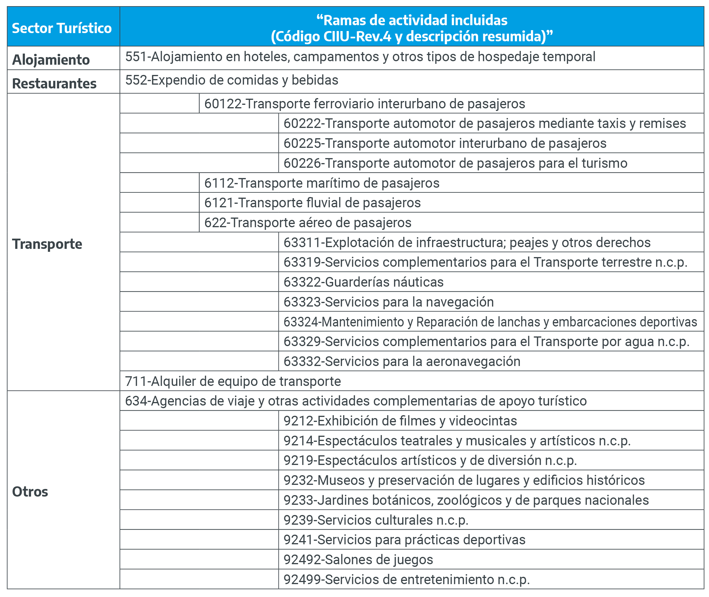

# **Fuentes de información** {#fuentes-informacion}

En este capítulo se presentan las fuentes de información disponibles para la medición de la contribución económica, en términos de actividad y empleo, de las Ramas Características del Turismo a nivel provincial, con el fin de analizar la heterogeneidad y limitaciones de cada una.

Es importante destacar que, en la actualidad, algunas fuentes de información que corresponden a operativos puntuales con períodos de realización de varios años no cuentan con información actualizada a los años recientes.Este es el caso de los censos económico y de población. Sin embargo, se espera que en los próximos años se publiquen nuevas ediciones de ambos operativos.

## Tipos de fuentes

Las fuentes de datos disponibles se pueden diferenciar en cinco clases:

-   **Encuesta a hogares**: Permite captar las características sociodemográficas de la población de manera regular, con información de los ingresos y la inserción en el mercado de trabajo de los miembros de los hogares.
    Los datos que proporciona abarcan las ocupaciones registradas y no registradas, por lo que todas las categorías ocupacionales son captadas, y de esta manera es posible estimar la producción informal.
    Tiene la ventaja, además, de capturar la naturaleza estacional del empleo -común en el turismo- y la categoría ocupacional.
    Aunque debido a que las actividades del turismo por lo general no están distribuidas en forma pareja a lo largo de la geografía del país, la encuesta, al estar basada en muestras, puede reflejar un número relativamente pequeño de casos de empleo en turismo.
    La imprecisión a causa del muestreo aumenta cuanto más se desagreguen los datos.
    Un ejemplo de este caso, es la Encuesta Permanente de Hogares (EPH), que realiza el INDEC.

-   **Encuesta a establecimientos:** Proporciona datos sobre producción, valor agregado y número de trabajadores en las nóminas de los establecimientos durante un período especificado, entre otros indicadores.
    No proporcionan una adecuada cobertura de las pequeñas empresas, generalmente numerosas en el sector turístico.
    Generalmente excluyen el sector estatal.
    En cuanto al empleo, a menudo incluyen información sólo de los empleados, a menos que exista una pregunta específica sobre el número de dueños o integrantes de la familia que trabajan.
    En Argentina se lleva a cabo la Encuesta Nacional a Grandes Empresas (ENGE), referidas al panel de las 500 grandes, con actividad principal de Minería, Industria Manufacturera, Electricidad, Gas y Agua, Gestión de Residuos, Saneamiento Público, Servicios de Información y Comunicaciones, Construcción, Comercio, Transporte y Otros servicios.
    Por sus características, esta encuesta no es significativa para una medición completa del sector a nivel provincial.

-   **Encuestas basadas en el seguro social:** Proporciona datos sobre cantidad de empresas y empleos y salarios para aquellos trabajadores que están protegidos por seguros de salud, accidentes o desempleo.
    Es recomendable utilizar estos datos, porque reduce la brecha sobre subgrupos que no están adecuadamente cubiertos por otras fuentes.
    Generalmente se excluye a los trabajadores no permanentes y a los trabajadores con contrato informal.
    En Argentina, la información proveniente del SIPA da cuenta con exactitud de los asalariados del sector privado inscriptos en la seguridad social.
    En términos estrictos, aunque se utiliza con fines estadísticos, se trata de un registro fiscal de carácter censal.

-   **Censo de población:** Relevamiento dirigido a captar información sobre personas, hogares y viviendas.
    En él se consignan datos referidos al comportamiento de la actividad laboral realizada por las personas que integran los hogares.
    La última información disponible corresponde al CNPHV 2010.
    Asimismo el CNPHV 2020 fue postergado con motivo de la emergencia sanitaria producto del COVID-19.

-   **Censo de actividad económica:** Brinda información sobre la actividad de las unidades productivas de un conjunto de sectores.
    El censo económico recoge información sobre producción, empleo, ingreso, composición de los costos, inversión, etc.
    Todos los datos están referidos al local (definido como el espacio físico donde se lleva adelante el desarrollo de la actividad productiva) y a las empresas (entendidas como las organizaciones que desarrollan las actividades productivas que tienen lugar en los locales).
    Es el caso del CNE del año 2004.
    Actualmente se está desarrollando el CNE 2020/2021, terminando su primera etapa de registro estadístico digital para pasar a la segunda etapa de realización de encuestas estructurales económicas y encuestas sectoriales en el año 2022.

En las secciones siguientes se procura brindar en detalle las principales características de cada fuente secundaria, marcando las diferencias existentes entre las mismas y sus ventajas y limitaciones.

## Medición de la actividad a nivel provincial: el Producto Geográfico Bruto (PGB)

**El PGB consiste en la producción de bienes y servicios finales realizada por la sociedad (empresas, autónomos, etc) de una provincia, durante un período de tiempo determinado.** También se lo puede denominar como PIB provincial, aunque PGB es el título más utilizado. 

La elaboración del PBG debe ser consistente con las normas del SCN 2008, adoptado por Argentina para la elaboración de sus cuentas nacionales. 

El PGB es necesariamente el punto de partida para la elaboración de una estrategia de estimación de la contribución económica del turismo en una provincia por el lado de la oferta. La utilidad de que las provincias cuenten con un PGB radica en que el mismo contendrá información de la actividad económica de la provincia pero abierta por sector de actividad. Cuanto mayor sea el nivel de desagregación de las actividades (mayor cantidad de dígitos de la CIIU), mayor será la precisión que se pueda obtener para realizar estimaciones de la contribución económica del turismo. A su vez, la información de actividad económica que pueda obtenerse de las ramas características del turismo, podrá ser comparada con el total de la economía a fin de tener una noción del peso del turismo en la economía provincial. 

Sin el agregado económico del PGB toda estimación de la oferta turística, que se pueda realizar por otros medios, no podrá ser cotejada para conocer si el monto obtenido por rama es consistente con la producción total de la provincia.

...........................................................................

## Medición del empleo provincial: características de las fuentes disponibles

Esta sección describe las fuentes disponibles para medir el empleo en ramas turísticas, teniendo en cuenta que cada una permite cubrir aspectos diferentes en cuanto a cobertura geográfica, categoría ocupacional -asalariado o independientes de distinto tipo-, calidad del empleo -grado de formalidad de los trabajadores-, unidad de análisis -puestos de trabajo o trabajadores-, entre otros.

### Censo Nacional de Población Hogares y Vivienda (CNPHV)

El CNPHV es llevado a cabo por el Instituto Nacional de Estadística y Censos (INDEC) cada diez años (aproximadamente).

En su condición de operativo de carácter masivo, resulta un instrumento adecuado para la captación de la actividad económica en situaciones económico-sociales de mayor estabilidad y en las que predominan relaciones laborales formales, regulares y estables (por la complejidad que implica la medición de la situación ocupacional de la población en situaciones de irregularidad).\

Si bien una de las ventajas del CNPHV es su amplia cobertura, una limitación es que transcurridos varios años luego de su realización los datos de empleo y desempleo se encuentran desactualizados.

Como se mencionó arriba, la última información disponible corresponde al CNPHV 2010, con información a nivel provincial de ocupación por rama agrupada y carácter de la ocupación.
Asimismo el CNPHV 2020 fue postergado con motivo de la emergencia sanitaria producto del COVID-19.

Un aspecto no menor es que el CNPHV considera a las personas, ocupadas o no, por la ubicación de su vivienda y las clasifica de acuerdo a su ocupación principal (independientemente de los puestos de trabajo que ocupe).

Por lo tanto, si se quisiera conocer la cantidad de puestos de trabajo, esta fuente no permite realizar tal estimación.

Por último, el CNPHV da cuenta de todas las personas ocupadas, independientemente de la categoría ocupacional (asalariado o empleado, cuentapropista, patrón), de la formalidad de la ocupación (a partir de la realización de aportes, sin distinguir si corresponden a descuentos o aportes realizados por la persona) y del ámbito (estatal o privado), así como de las ramas de actividad a las que corresponde el establecimiento en que trabaja la persona ocupada.

Por último, retomando un punto mencionado más arriba, es preciso señalar que si bien el carácter censal de los datos provenientes de esta fuente pueden hacer suponer que la calidad de los mismos es superior a los datos provenientes de encuestas por muestreo, esto no necesariamente es así.

Al ser un censo un operativo simultáneo y masivo, cientos de miles de personas participan como censistas y, por lo tanto, su capacitación resulta incomparable con la que reciben unos pocos cientos de personas, profesionales en la materia, que de modo continuo relevan información en hogares; particularmente, la medición del mercado de trabajo implica una importante complejidad conceptual.

Así, por ejemplo, el CNPHV del 2001 sobreestimó cerca de un 50% la desocupación en los grandes aglomerados urbanos (frente a la tasa que surgía en ese periodo de la EPH), por clasificar como desocupados a personas que desde las definiciones que regulan la producción de estadísticas de mercado de trabajo a nivel internacional debían ser señaladas como ocupados (personas que trabajaban pocas horas, que se dedicaban a hacer "changas" sin horario ni carga de trabajo fija, etc.).

### Censo nacional económico

El CNE provee información básica para una descripción detallada de la estructura productiva del país, tanto a nivel nacional, como a nivel provincial y de áreas menores.
La ocupación está medida por los puestos de trabajo ocupados por asalariados y no asalariados.

Esto significa que contempla que una misma persona puede tener más de una ocupación, a diferencia del CNPHV, que mide solo personas ocupadas.Sin embargo, no permite conocer cuántas personas ocupan esos puestos de trabajo, puesto que en una porción no desdeñable una persona ocupa dos, e incluso, más puestos.

Asimismo, en el concepto de puestos de trabajo no se incluye al personal de agencias de personal temporario y a las personas físicas contratadas en el local que cobran por factura y trabajan bajo la dirección de la empresa. Los pagos correspondientes, en estos últimos casos, forman parte del consumo intermedio, ya que constituye un servicio de terceros.

En razón de las características del CNE, como relevamiento dirigido a locales, se pueden identificar los siguientes puntos críticos: 

* **a.** el subregistro del número de locales productivos como resultado de la no visibilidad de unidades que no llegan a ser identificadas por los censistas, 
* **b.** el carácter no exhaustivo de la cobertura territorial del relevamiento, 
* **c.** la subdeclaración de los niveles de producción y de ocupación por parte de los locales efectivamente censados, y 
* **d.** el hecho que el último CNE fue realizado hace una década, en el año 2004 (tomando como periodo de referencia el año 2003).

Debe tenerse en cuenta que los Censos Económicos no incluyen información sobre el sector agropecuario que cuenta con un operativo especial y que en particular el Censo del 2004 no contó con los datos relevados por el operativo censal correspondientes al Sector Construcción (Letra F del ClaNaE CNE04) y a la Rama de Actividad Transporte Automotor de Carga (Rama 60210 del ClaNaE CNE04).

En lo referido a la cobertura del operativo, se debe aclarar que las localidades con menos de 1.000 habitantes no fueron relevadas[^fuentes-informacion-1].

[^fuentes-informacion-1]: Este límite es variable, ya que algunas provincias resolvieron el relevamiento completo de las áreas pobladas.

**Censo Nacional Económico 2020/2021**

Si bien los puntos mencionados son pertinentes para la última versión disponible del CNE, el nuevo censo que se está llevando a cabo tiene un abordaje metodológico diferente al anterior, así como nuevos procedimientos, que intentan resolver algunos de los puntos críticos del enfoque previo, a la vez que pueden surgir nuevos.

Algunos puntos para destacar del nuevo operativo, que lo diferencian del anterior son: 

- Define como unidad estadística a la "empresa" y no al "local".
- Empadronamiento digital a través de un sitio web, mediante un formulario a ser completado por los agentes económicos (empresas, ISFL, monotributistas y autónomos), reemplazando el barrido territorial de establecimientos productivos y entrega de los formularios censales.
- Complemento de la información con datos agregados a nivel sectorial provenientes de la AFIP 
- Encuestas estructurales digitales por muestreo para obtener información de producción e insumos desagregados por actividad y producto, canales y márgenes de transporte y comercio, entre otros.

Visite la página oficial del Censo Nacional Económico [aquí](https://censoeconomico.indec.gob.ar/)

### Encuesta Permanente de Hogares (EPH)

La EPH es un operativo especialmente diseñado para medir la situación de la población en relación con el mercado de trabajo y describir con precisión las características de la fuerza de trabajo, en el cual trabajan regularmente encuestadores capacitados en los conceptos intrínsecos de un instrumento de medición específico.

Por ello, si bien como cualquier estudio por muestreo está sujeto a diferentes niveles de error estadístico, la calidad de la información recolectada garantiza la casi inexistencia de errores no estadísticos (habituales en los censos de población, por ejemplo, llevados a cabo por una vasta cantidad de censistas con una mínima capacitación).

La EPH es un programa nacional de producción sistemática (con ondas trimestrales) y permanente de indicadores sociales realizada por el INDEC y las direcciones de estadística provinciales, que permite conocer las características socioeconómicas y demográficas de la población en los principales centros urbanos del país.

Es una encuesta de propósitos múltiples que releva información sobre hogares y personas en torno a las siguientes temáticas: situación laboral, características demográficas básicas (edad, sexo, etcétera), características migratorias, habitacionales, educacionales e ingresos.

El alcance de la EPH comprende alrededor del 70% de la población urbana y poco más del 60% de la población nacional.

La unidad de registro es por persona ocupada, clasificada de acuerdo a su lugar de residencia.

La cobertura geográfica alcanza a 31 aglomerados urbanos del país.

Desde el año 2003 hasta el segundo trimestre de 2006 se relevaban 28 aglomerados urbanos; a partir del tercer trimestre de 2006, con la incorporación de San Nicolás -- Villa Constitución, Viedma -- Carmen de Patagones y Rawson -- Trelew, se amplió la cobertura de la encuesta a 31 centros urbanos.

### EPH Total Urbano

Este operativo es una ampliación de la cobertura territorial de la EPH.Permite contar con la misma información que en la EPH pero para el total de la población urbana del país, a través de la incorporación a la muestra de los hogares pertenecientes a localidades de 2.000 y más habitantes.

Se realiza en la onda correspondiente al tercer trimestre de la EPH y su cobertura alcanza al 90% de la población total del país.

La información obtenida puede ser desagregada para cada gran aglomerado urbano y para los restos urbanos provinciales (es decir, población urbana sin contar los residentes en el o los grandes aglomerados).

Se encuentra disponible para el período 2010-2014 como Encuesta Anual de Hogares Urbanos (EAHU) y a partir de 2016 como EPH total urbano.

### Sistema Integrado Previsional Argentino (SIPA)

La información básica a partir de la cual se captan los datos del SIPA proviene de las declaraciones juradas realizadas por las empresas.

Las empresas se clasifican por actividad económica según cómo se inscriban en la AFIP.
Dicha inscripción se realiza una única vez por cada entidad contribuyente, asignando el CUIT (Código Único de Identificación Tributaria) de acuerdo a la actividad principal que declaran las mismas.

Por diferentes causas, tales como descripción incompleta o incorrecta de la actividad o cambios de la misma a lo largo del tiempo, empresas dedicadas a una misma tarea pueden quedar asignadas a clasificaciones diferentes.

Por esta razón, en su transformación a información estadística se han examinado algunos sectores recodificando la actividad original (estos ajustes son realizados para la información publicada por el Ministerio de Trabajo, Empleo y Seguridad Social -MTEySS-).

El SIPA es un sistema que contabiliza a las personas físicas mayores de 18 años de edad que desempeñan alguna actividad como asalariados y a los que sus empleadores les realizan los aportes previsionales; es decir, sólo alcanza a los puestos de trabajo asalariados del sector privado registrado (es decir, a los que las empresas les realizan los descuentos dirigidos a la seguridad social), dejando por fuera a los trabajadores no englobados en esta categoría (sean asalariados o independientes).

El MTEySS publica mensualmente la evolución de los trabajadores privados registrados a nivel nacional por rama de actividad de la ocupación principal (agrupamiento en 15 ramas), así como la evolución de los asalariados registrados por provincia sin desagregación sectorial.

El Observatorio de Empleo y Dinámica Empresarial (OEDE), dentro del MTEySS, publica la información de asalariados registrados tanto a nivel nacional como provincial con una desagregación a 4 dígitos del CIIU rev. 3 con periodicidad trimestral (en algunos casos, como Servicio de transporte ferroviario, la desagregación es a 3 dígitos).

### Síntesis comparativa de las fuentes

#### Comparación de las fuentes disponibles

En la figura \@ref(fig:empleofuentes1) se aprecia una síntesis de las principales características de las fuentes de información descriptas a lo largo de la sección anterior, mientras que en la \@ref(fig:empleofuentes2) se detallan las principales fortalezas y debilidades de cada una.

```{r empleofuentes1, echo=FALSE, fig.cap="Resumen de las principales fuentes de información" }
knitr::include_graphics('imagenes/figura3.1.jpg')
```

```{r empleofuentes2, echo=FALSE, fig.cap="Fortalezas y debilidades de las principales fuentes" }
knitr::include_graphics('imagenes/figura3.2.jpg')
```

#### Categorías ocupacionales

Como ya se adelantó, la OIT categoriza un empleo según el tipo de contrato de trabajo explícito o implícito del titular con otras personas u organizaciones agrupadas en el CISE, donde se detallan las distintas modalidades vigentes.

El criterio básico utilizado para definir cada grupo de categoría o clasificación ocupacional es del tipo de riesgo económico, un elemento del cual depende exclusivamente la solidez del vínculo entre la persona y el empleo, y el tipo de autoridad que tiene el trabajador sobre el establecimiento.

Cabe señalar que habitualmente la categoría ocupacional refiere al tipo de relación (patrón, cuenta propia, empleado, etc.).

En este caso, en realidad, la categoría ocupacional refleja una tipología que contempla tres variables: la categoría ocupacional propiamente dicha; el ámbito al que corresponde el establecimiento (privado o estatal); y el nivel de formalidad, determinado por la presencia o no de descuentos o aportes previsionales.

Además de las diferencias de cobertura en el universo de ocupados, no todas las fuentes secundarias presentadas exhiben el mismo nivel de apertura de los datos por categoría ocupacional, como puede observarse en la figura \@ref(fig:empleofuentes3).
El SIPA sólo da cuenta del universo de trabajadores asalariados del sector privado a los que se les realizan descuentos jubilatorios.

El CNE alcanza a todo el sector privado, pero no permite distinguir los niveles de formalidad entre trabajadores asalariados y no asalariados.
Las encuestas a hogares y los censos dan cuenta de todos los ocupados, pero su forma de clasificarlos presenta algunas diferencias.

```{r empleofuentes3, echo=FALSE, fig.cap="Categoría ocupacional según fuente de información" }

```

Si bien tienen un peso relativamente marginal, la EPH permite distinguir casos de asalariados sin descuento jubilatorio pero con aportes (esto es, una relación de dependencia encubierta), mientras que el CNPHV junta ambas categorías.

En cambio, las encuestas a hogares mencionadas no permiten conocer el nivel de formalidad de trabajadores independientes, mientras que esto sí es posible a partir del Censo, pues la indagación sobre aportes jubilatorios alcanza a todos los ocupados (en las encuestas, solo a los asalariados).

#### Tipos de informalidad

La apertura de la información por categoría ocupacional permite arribar a un aspecto central de la medición del empleo: la informalidad laboral, indicador que permite aproximarse a la calidad del empleo.

Por ello, para complejizar y enriquecer el análisis se han establecido tres tipos de informalidad, en función de la mirada focalizada en distintos segmentos del mercado de trabajo:

-   **Informalidad Total (IT):** Refleja el peso agregado de los cuentapropistas informales y los asalariados del sector privado y estatal sin aportes ni descuentos sobre el total de ocupados.

-   **Informalidad en el Ámbito Privado (ISP):** Considera el peso agregado de los cuentapropistas informales y los asalariados del sector privado sin aportes ni descuentos sobre el total de ocupados del sector privado (excluye a los asalariados del sector estatal).

-   **Informalidad en el Ámbito Privado Asalariado (ISPA):** Refleja la participación de los asalariados del sector privado sin aportes ni descuentos sobre el total de asalariados del sector privado (excluye a los asalariados del sector estatal y a los patrones y cuentapropistas -formales e informales-).

## Ramas Características, ramas mixtas y agregación de las RCT por sector

Tal como se explicó en el primer capítulo, cuanto menor sea el nivel de apertura que presente la información por rama, menor será la precisión de los resultados obtenidos.
Esto significa, por ejemplo, que si una determinada fuente brinda únicamente los datos globales a dos dígitos CIIU de la Rama Transporte de Servicios Terrestres, la estimación incluirá componentes no relacionados con el turismo, por ejemplo, el Transporte de Carga.
Esto implica una sobreestimación de la cantidad de puestos de trabajo, personas ocupadas y, en general, del peso del empleo en el sector turístico.

En cambio, si la información se presenta en un nivel de detalle mayor, permite discriminar mejor qué es y qué no es característico del sector bajo estudio.

En aras de simplificar la presentación de resultados y, fundamentalmente, de obtener estimaciones estadísticamente robustas, las ramas características del sector turístico pueden ser agrupadas en cuatro grandes sectores: Servicios de Alojamiento; Servicios de Restaurantes; Servicio de Transporte; y Otros Servicios Turísticos.

El detalle de las ramas contenidas en cada uno de estos sectores puede apreciarse en la figura \@ref(fig:empleofuentes4). Como allí se observa, no todas las ramas corresponden al mismo nivel de desagregación: en algunos casos se han incluido actividades a tres dígitos, en otros a cuatro y, finalmente, en los casos restantes las actividades corresponden a una clasificación a nivel de cinco dígitos.

Como se mencionó, el nivel de desagregación de las actividades económicas en las fuentes es variable y en una importante cantidad de casos no está presente con la apertura requerida.

```{r empleofuentes4, echo=FALSE, fig.cap="Listado de RCT y agrupamiento en cuatro grandes sectores turísticos" }

```

Para analizar la convergencia de las RCT a partir de cada fuente y determinar cuánto de lo que hay disponible se acerca al ideal que establece la CIIU, se organizaron las ramas en un esquema de colores semejantes a un semáforo para establecer en qué punto todo el componente es turístico.

Por ejemplo, el sector de Transporte Aéreo incluye la rama "Servicios de Transporte Aéreo de Pasajeros" y "Servicios de Transporte Aéreo de Carga", donde solo la primera de ellas es una RCT.

Cada uno de los colores en las tablas expresan lo siguiente:

-   **VERDE:** Código compuesto por actividades correspondientes en su totalidad a la industria turística.
-   **AMARILLO:** Código bajo el cual coexisten tanto componentes de industria turística y de otras actividades económicas no características.
-   **ROJO:** El código no corresponde a una industria turística, aunque si comparte con alguna de estas un código de menor apertura. Adicionalmente, en cada una de las tablas se indica cuál es el código que corresponde a cada fuente, de acuerdo al clasificador considerado en ellas[^fuentes-informacion-2].

[^fuentes-informacion-2]: La EPH fue objeto de un cambio en el nomenclador de actividades, ya que el vigente hasta 2011 fue reemplazado por una actualización de ese mismo año.

### Sector Alojamiento y Restaurantes

Estos dos sectores no presentan ninguna dificultad, pues todos sus componentes son característicos del turismo.

La rama 55 incluye ambos sectores, que se dividen a partir de los tres dígitos.
Dado que todas las fuentes utilizadas presentan esta apertura, es posible utilizar los datos originales que cada una de ellas provee (figura \@ref(fig:empleofuentes5)).

```{r empleofuentes5, echo=FALSE, fig.cap="Alojamiento y restaurantes. Clasificación de actividades por fuente" }
knitr::include_graphics('imagenes/figura3.5.jpg')
```

### Sector Transporte

Los servicios de transporte constituyen una actividad fundamental para la circulación de personas y carga.

En esta sección se incluyen los servicios organizados por cuenta de terceros, sean estos una prestación de tipo colectiva, individualizada o realizada a través del alquiler del vehículo de transporte con su respectivo personal de conducción.

El sector transporte se compone, siguiendo la clasificación a dos dígitos, en 4 subsectores: terrestre, acuático, aéreo, servicios anexos y alquiler de vehículos sin chofer.

El transporte **terrestre** se desagrega (a tres dígitos) en ferroviario, automotor por carretera y por tuberías (que no corresponde a una actividad característica del turismo).
A cuatro dígitos, tanto el transporte ferroviario como el automotor se discrimina en carga y pasajeros, mientras que, a 5 dígitos, se especifica qué tipo de servicios de pasajeros se presta (figura \@ref(fig:empleofuentes6)).

```{r empleofuentes6, echo=FALSE, fig.cap="Transporte Terrestre. Clasificación de actividades por fuente" }

```

En el caso del transporte ferroviario, sólo se considera característico el transporte de pasajeros interurbano.

Tanto el SIPA como la EPH presentan la información a tres dígitos (sin discriminar no solo servicios urbanos e interurbanos sino tampoco servicios de carga).

Una forma de aproximar el componente turístico del transporte ferroviario, exluyendo los servicios urbanos y de carga, es obtener un coeficiente que surge del peso relativo de la rama a 5 dígitos "Transporte interurbano de pasajeros" sobre la rama "Transporte ferroviario", en este caso a partir de la única fuente disponible a 5 dígitos, el CNE 04.
Resulta útil ofrecer un ejemplo para facilitar la comprensión

::: {.note} Según el CNE 2004, los puestos de trabajo correspondientes al transporte ferroviario eran 18.245 y se distribuían de la siguiente forma en la apertura a 5 dígitos: - ***5.919*** puestos correspondían a servicio de cargas (6011) - ***10.086*** puestos correspondían a servicio de pasajeros urbano y suburbano (60121) - ***2.240*** puestos correspondían al servicio de pasajeros interurbano (60122) Por tanto, sólo los ***2.240 puestos*** (pasajeros interurbano) de los ***18.245*** puestos totales del transporte ferroviario correspondían a actividades características.

El coeficiente expresa la participación de los componentes característicos en la suma de todos los componentes involucrados en la desagregación de cada fuente, por lo que en este caso asciende a 0,1228 (2.240/18.245) o, lo que es lo mismo a 12,28%.

Así, de los 26.807 puestos de trabajo (asalariados con descuento del ámbito privado) informados por el SIPA para el año 2010 en la actividad transporte ferroviario, 3.227 (cantidad que surge de: 26.8070,1228) serán contabilizados como puestos de trabajos de la actividad característica del sector (servicio interurbano de pasajeros)
:::

En el caso del transporte automotor, los componentes característicos a 5 dígitos son los servicios de taxis y remises (60222), los servicios de pasajeros regulares interurbanos (60225) y los servicios de transporte para el turismo. Siguiendo la lógica planteada, para extraer la cantidad correspondiente a las actividades características del turismo de cada fuente es posible calcular un coeficiente que exprese el peso de las tres actividades mencionadas sobre el total de actividades incluidas en el código que las contiene.

Las figuras \@ref(fig:empleofuentes7) y \@ref(fig:empleofuentes8)  presentan el detalle para el transporte acuático y para el transporte aéreo respectivamente.

```{r empleofuentes7, echo=FALSE, fig.cap="Transporte Acuático. Clasificación de actividades por fuente" }
knitr::include_graphics('imagenes/figura3.7.jpg')
```

```{r empleofuentes8, echo=FALSE, fig.cap="Transporte Aéreo. Clasificación de actividades por fuente" }

```

En la figura \@ref(fig:empleofuentes9) se presenta el detalle de la rama 63, que incluye servicios anexos al transporte y agencias de viaje, esta última pudiendo ser presentada en Otros Servicios Turísticos o como un sector separado.

```{r empleofuentes9, echo=FALSE, fig.cap="Servicios Anexos al transporte y agencias de viaje. Clasificación de actividades por fuente" }
knitr::include_graphics('imagenes/figura3.9.jpg')
```


Finalmente, la figura \@ref(fig:empleofuentes10) muestra la posición del componente "Alquiler de transporte sin chofer" dentro de la rama 71, que incluye el alquiler de transporte, maquinarias y equipos.

```{r empleofuentes10, echo=FALSE, fig.cap=" Alquiler de equipo de transporte, maquinarias y equipo. Clasificación de actividades por fuente." }
knitr::include_graphics('imagenes/figura3.10.jpg')
```

### Secto Otros Servicios Turísticos

Este sector comprende un subconjunto de actividades deportivas, sociales, culturales, recreativas y de interés local agrupadas en la rama 92, del cual da cuenta la \@ref(fig:empleofuentes11).

```{r empleofuentes11, echo=FALSE, fig.cap=" Servicios de Esparcimiento, Culturales y  Deportivos. Clasificación de actividades por fuente." }
knitr::include_graphics('imagenes/figura3.11.jpg')
```


## Acceso a la información presentada

Todas las fuentes de información aquí descriptas se encuentran disponibles al público en general, a excepción del CNE 04/05, que publica cuadros a nivel provincial por ramas agrupadas de actividad (v.g. "Hoteles y Restaurantes")
A continuación se especifica la ubicación en Internet de cada fuente, indicando el tipo de información disponible.
Cabe señalar que junto con la información podrán encontrarse los documentos metodológicos básicos.

[**EPH y EPH total urbano**](https://www.indec.gob.ar/indec/web/Institucional-Indec-BasesDeDatos-1) Las bases de datos se brindan en formato TXT a partir de 2016 y en SPSS, Stata y DBF para los años previos.
Recordar que para la EPH existe una base trimestral, mientras que para la EPH total urbano -o EAHU para 2010-2014- sólo una base anual, que corresponde al tercer trimestre de cada año.

[CNPVH](https://www.indec.gob.ar/indec/web/Nivel3-Tema-2-41). Para los censos de 2001 y 2010 se puede utilizar (en línea) el programa REDATAM, que permite procesar la información de manera sencilla. 

[CNE](https://sitioanterior.indec.gob.ar/cne2005_index.asp) Tablas (formato Excel) para el total país y para cada provincia por sector de actividad económica.

[SIPA-MYEySS](https://www.trabajo.gob.ar/estadisticas/oede/estadisticasregionales.asp) se presenta una conjunto de tablas con información provincial en formato Excel para descargar, entre las que figura la serie trimestral de empleo registrado por rama de actividad a cuatro dígitos.

## Ejemplos de utilización de las fuentes

A modo de ejemplo de uso de algunas de las fuentes presentadas en las secciones precedentes, se ilustran posibles aplicaciones para la medición del empleo provincial en ramas turísticas, teniendo en cuenta los lineamientos conceptuales de los capítulos anteriores. Se hará énfasis en las fuentes disponibles con actualizaciones recientes, con el objetivo de tener un acercamiento más actual a la información de empleo en el sector. En este sentido, las fuentes que se actualizan de manera trimestral y contienen información relativa al empleo en ramas turísticas son la EPH y las estadísticas de empleo registrado del OEDE-MTEySS a partir del SIPA. En el caso de la primera debe tenerse en cuenta, como se mencionó anteriormente, que se trata de una encuesta probabilística, sujeta al margen de error estadístico. Por este motivo, teniendo en cuenta que el diseño de la encuesta no asegura la robustez de las estimaciones con apertura sectorial y geográfica, los resultados deben tomarse con cautela y, preferentemente, elegir un agrupamiento de trimestres que permita tener una cantidad de casos muestrales significativa. A esto se suma el hecho de que la cobertura geográfica de la EPH es de 31 aglomerados urbanos, y no de las provincias en su conjunto. Puede complementarse el análisis con la extensión de la cobertura de la EPH total urbano, únicamente para los terceros trimestres del año. La ventaja de esta fuente de información, como se ha mencionado, es que incluye a todas las categorías de ocupados: asalariados-con y sin aportes y/o descuento jubilatorio- e independientes -patrón o cuenta propia-

**ACÁ VA UN GRÁFICO CON TASA DE INFORMALIDAD PARA RCT POR AGLOMERADO (PROMEDIO ALGUNOS AÑOS)**

La otra fuente actualizada para medir el empleo en ramas características del turismo es la publicación trimestral de los asalariados registrados por rama de actividad a 4 dígitos del OEDE-MTEySS a partir del SIPA. Al provenir de un registro administrativo, no está sujeta a errores de muestreo y tiene cobertura provincial[^fuentes-informacion-3]. Una desventaja de esta información reside en que algunas ramas se encuentran abiertas a 3 dígitos, por ejemplo "Servicios de transporte ferroviario" se encuentra a 3 dígitos de apertura (rama 6010), por lo que incluye servicio de carga y pasajeros. Sucede lo mismo con los transportes marítimo, fluvial y aéreo. El transporte automotor se encuentra a 4 dígitos, por lo que permite la separación de carga y pasajeros (rama 6022) pero no distinguir el transporte de pasajeros urbano e interurbano.
Asimismo, el origen de la información implica que no se incluyan trabajadores no registrados ni independientes. La figura  .. muestra los trabajadores registrados por provincia, promediando los 4 trimestres de 2019, para todas las ramas y para las ramas turísticas.

[^fuentes-informacion-3]: La información publicada, en el caso de la provincia de Buenos Aires, está dividida en GBA y Resto de Buenos Aires. En esta sección se sumaron ambas regiones para obtener el total de la provincia


```{r empleografico1, echo=FALSE }

```

A continuación, se muestra la participación de las ramas turísticas en el total del empleo registrado, para el mismo período de medición.

```{r empleografico2, echo=FALSE }
knitr::include_graphics('imagenes/empleo.prov.part.png')
```

El siguiente gráfico muestra la participación de cada categoría dentro del empleo en ramas características: 

```{r empleografico3, echo=FALSE }
knitr::include_graphics('imagenes/empleo.prov.part.agrup.png')
```

